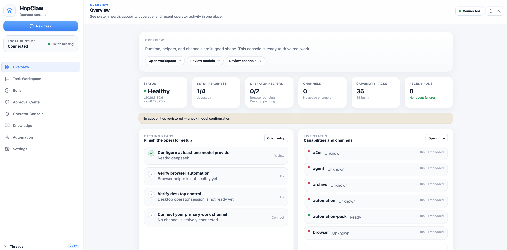

# HopClaw

[简体中文](./README.zh-CN.md)

**A Go runtime for tool-using AI agents.** Inspired by [OpenClaw](https://github.com/openclaw/openclaw) — lighter, single-binary, easier to deploy.

<p align="center">
  
</p>

## Why HopClaw

OpenClaw is the most complete open-source AI Agent platform today. HopClaw takes the same direction — agent execution with approvals, audit, multi-channel messaging, and 80+ built-in tools — and reimplements it in Go for a different deployment profile:

| | OpenClaw (TypeScript) | HopClaw (Go) |
|---|---|---|
| Install | Node 22 + pnpm + hundreds of deps | One command, one binary |
| Memory | 800MB+ | ~60MB |
| Startup | ~10s | ~1s |
| Runtime deps | Node.js required | Zero |
| Deploy | npm install | curl \| sh |

## Install

### macOS / Linux

```sh
curl -fsSL https://hopclaw.com/install.sh | sh
```

### Windows PowerShell

```powershell
irm https://hopclaw.com/install.ps1 | iex
```

### Guided Onboarding

```sh
curl -fsSL https://hopclaw.com/install.sh | HOPCLAW_INSTALL_RUN_ONBOARD=1 sh
```

## What It Does

- **25+ messaging channels**: Feishu, Slack, Discord, Telegram, WhatsApp, Signal, Google Chat, LINE, Teams, IRC, Matrix, Mattermost, and more
- **80+ built-in tools**: files, exec, web search, browser, desktop, email, calendar, Word/Excel/PPT
- **Approval governance**: policy engine for tool calls — block, ask, or allow
- **Audit trail**: every action recorded
- **Browser & desktop automation**: via standalone `hopclaw-browserd` and `hopclaw-desktopd` helpers
- **Skill ecosystem**: SKILL.md format, ClawHub-compatible discovery
- **China-friendly models**: DeepSeek, Qwen, Moonshot, MiniMax, Baichuan, Volcengine, Hunyuan, SiliconFlow — plus OpenAI

## Current Status

- **Binary releases available now** — install and use today
- **Source code will be opened in the coming weeks** — currently being cleaned up for public release
- **Apache-2.0 license**

## Quick Links

- Website: https://hopclaw.com
- Documentation: https://hopclaw.com/docs
- Releases: https://github.com/hopclaw/hopclaw/releases
- Issues: https://github.com/hopclaw/hopclaw/issues

## Reporting Bugs

1. Run `hopclaw doctor`
2. Optionally generate a redacted bundle: `hopclaw bug-report`
3. Open an issue with version, platform, and reproduction steps

Security-sensitive reports: see [SECURITY.md](./SECURITY.md).

## Contributing

Source code contributions are not accepted yet (source not public). Right now the most valuable contributions are:

- **Install & try it** — report what works and what doesn't
- **Scenarios** — tell us what you'd want an AI agent to do in your workflow
- **Docs & tutorials** — help others get started
- **Skills & plugins** — any language, not just Go
- **Frontend** — the operator console needs work

See [CONTRIBUTING.md](./CONTRIBUTING.md) for details.

## License

Apache-2.0. See [LICENSE](./LICENSE).
